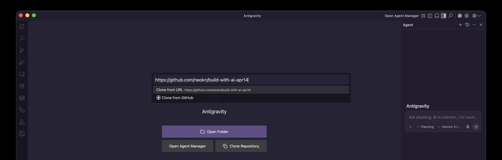
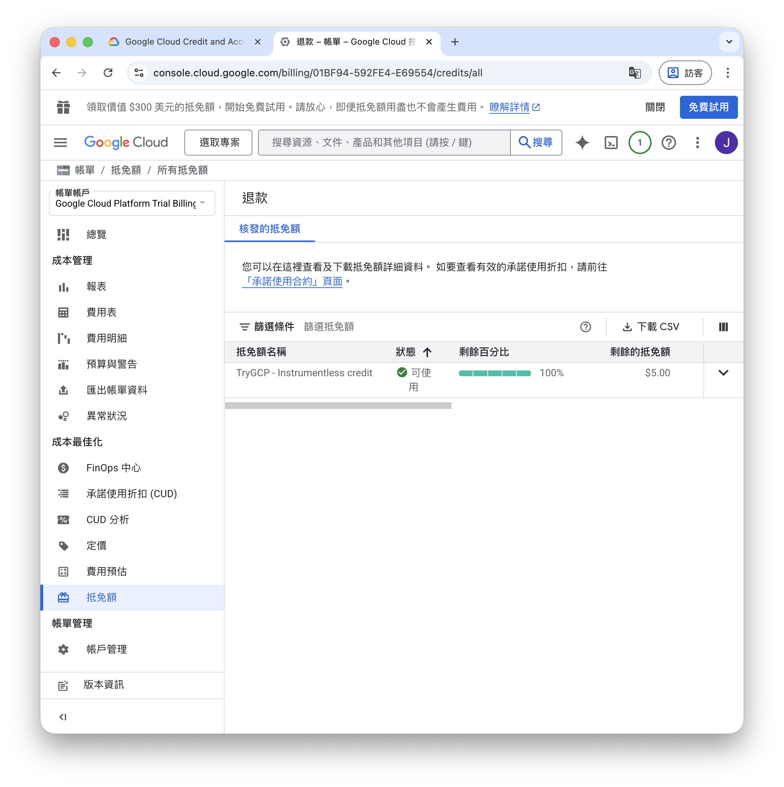

# Build with AI — ADK Go Telegram Bot 工作坊指南

這份指南將帶領你一步步將這個 ADK Go + Gemini 的 Telegram Bot 專案跑起來。

## 步驟預覽
1. [環境與相關資源安裝](#1-環境與相關資源安裝)
2. [取得並設定 Vertex AI API Key](#2-取得並設定-vertex-ai-api-key)
3. [建立與設定 Telegram Bot](#3-建立與設定-telegram-bot)
4. [啟動專案](#4-啟動專案)
5. [開始對話與測試](#5-開始對話與測試)

---

## 1. 環境與相關資源安裝

執行前請確保您已安裝或準備好以下基礎安裝：
- **Go 語言**：請參考 [Go 官方安裝指南](https://go.dev/doc/install) 進行安裝。
- **Git**：請參考 [Git 官方安裝指南](https://git-scm.com/downloads) 進行安裝。
- **Node.js**：請參考 [Node.js 官方安裝指南](https://nodejs.org/zh-tw/download) 進行安裝。
- **Antigravity**：建議使用，請前往 [Antigravity 下載頁面](https://antigravity.google/download) 下載安裝。

### 快速取得程式碼

建議打開 Terminal，並執行以下指令取得專案：

```bash
git clone https://github.com/neokn/build-with-ai-apr14.git
cd build-with-ai-apr14
```

> 如果你是使用 Antigravity 進行工作坊：
> 

### 配置環境變數檔

準備專案所需的環境變數檔案，複製一份 `template.env` 並重新命名為 `.env`：

**記得開頭有一個「點」！！！**

```bash
cp template.env .env
```

---

## 2. 取得並設定 Vertex AI API Key

> **重要!! 重要!! 重要!!**  
> 如果有取得抵免額 (credit) 的朋友請用相同的 Google 帳號操作以下步驟  
> 建議用**訪客模式/無痕模式**避免 Vertex AI Studio & GCP Console 切換過程帳號不一致
> 

### 建立 API Key
打開 [Vertex AI Studio](https://console.cloud.google.com/vertex-ai/studio/settings/api-keys)
新增 API Key。

> 如果有權限問題，需要先將自己的帳號新增 `Organization Policy Administrator` 權限，接著依照指引關閉 `iam.managed.disableServiceAccountApiKeyCreation`。

### 設定 API Key
將你複製好的 API Key 填入 `.env` 檔案中：
```
GOOGLE_GENAI_API_KEY=your_api_key
```

**記得存檔！！！**

---

## 3. 建立與設定 Telegram Bot

### 開啟 BotFather
1. 在 Telegram 中搜尋 `@BotFather` 並開啟對話（請認明有官方認證藍勾勾的帳號）

### 建立新的 Bot
2. 發送 `/newbot` 指令來建立新的機器人
3. 依照指示依序輸入：
   - **顯示名稱（Name）**：你想要的 Bot 名字
   - **使用者名稱（Username）**：必須以 `bot` 結尾，例如 `my_awesome_bot`
4. 建立成功後，BotFather 會提供一段 **HTTP API Token**（長得像 `123456789:ABCdefGHIjklmNOPQrsTUVwxyZ`）
5. 複製這段 Token

### 設定 Telegram Bot Token
將這段 Token 填入 `.env` 檔案中：
```
TELEGRAM_BOT_TOKEN=your_bot_token
```
**再次記得存檔！！！**

---

## 4. 啟動專案

程式內建多種模式，共用同一個 ADK Go Agent。你可以從下方挑選一種方式啟動：

### 模式 A: Telegram Bot 模式

在終端機執行下列指令：
```bash
go run ./cmd/telegram/
```
啟動成功的話應該會看到類似這樣的 log：
```
INFO agent ready model=gemini-3-flash-preview
INFO telegram bot started
```

### 模式 B: ADK Dev UI 模式（本地測試）
> 💡 這個模式不需要 Telegram Token，只需要 Gemini API Key 就能使用。適合用來除錯與觀察。

```bash
go run ./cmd/telegram/ web --port 9090 api webui --api_server_address http://localhost:9090/api
```
啟動後在瀏覽器打開 `http://localhost:9090` 就能看到 ADK 內建的開發者 UI，可以直接跟 Agent 對話、查看 Session 歷史、觀察 Tool 呼叫過程。

### 模式 C: ADK Console（CLI 互動模式）
如果你想直接在終端機裡面與 Agent 對話測試：
```bash
go run ./cmd/telegram/ console
```

---

## 5. 開始對話與測試

啟動**模式 A**後，在 Telegram 找到你剛建立的 Bot，直接傳送訊息就可以開始對話了！

Bot 第一次啟動時還沒有名字，會請你幫它取一個名字。
命名完成後，Bot 會以新名字自稱，並作為你的 AI 助手回答各種問題。

## 6. 實作練習

實作一個你自己的工具，例如：取得一個隨機數
